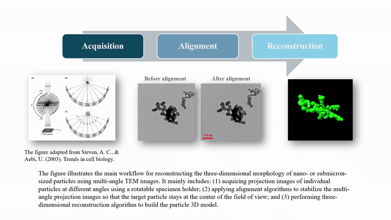

# Tomo
Based on the particle boundary contours in each slice of the tomogram generated by electron tomography, we perform dipole filling (i.e., discretization into dipoles). The resulting particle models can be used for three-dimensional morphological analysis and single-particle optical simulations. The original article describing this algorithm is provided at the link below.
https://doi.org/10.1016/j.jqsrt.2020.107184

A schematic of the workflow of electron tomography reconstruction: 
